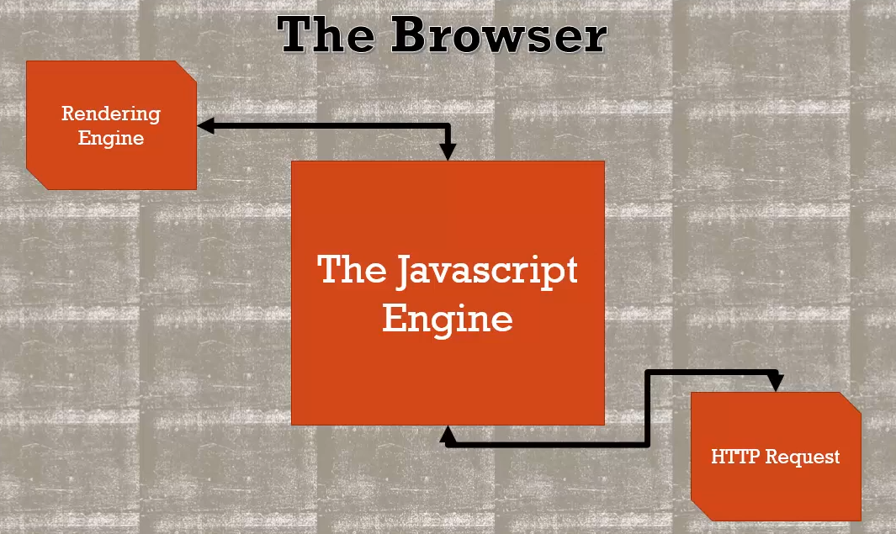
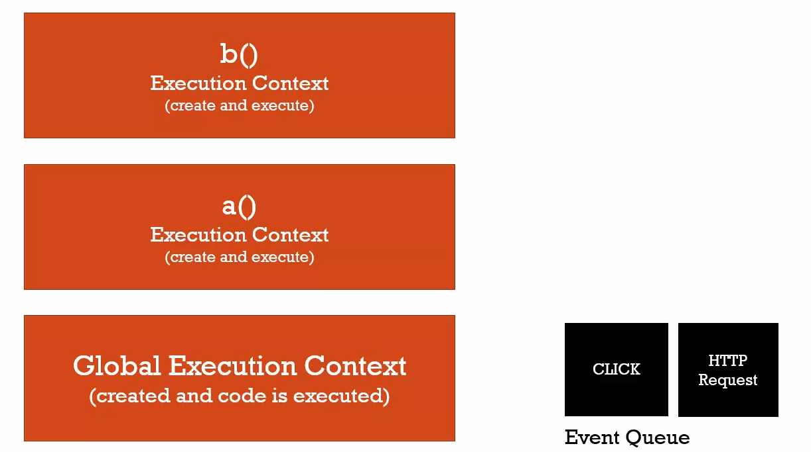
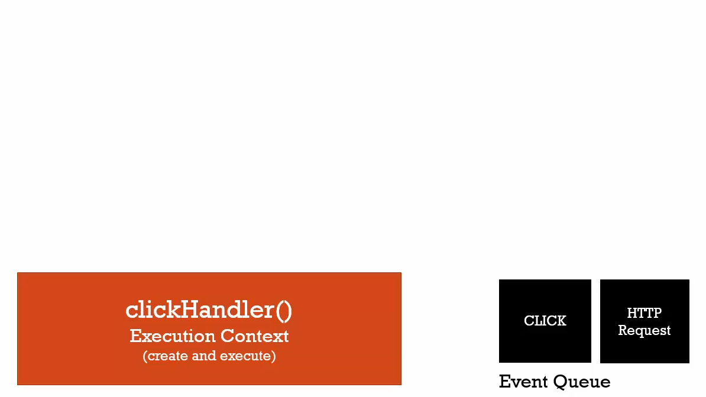

## Asynchronous callback (event Loop)
Asynchronous: more than one at a time.



**if js is synchronous how is it handling the async events?**
+ js engine is a part of the browser , browser has some other stuffs.
+ Like rendering engine, HTTp request and all.
+ JS engine has hooks where it can talk to rendering engine and change what the web page look like.
+ or go out and request data with HTTPrequest 
+ these stuffs are running asyncly However
+ what's happeining inside the JS engine is synchronous.

Question is ? 
so when we asynly go out and make a request we say lets run a function when person clicks button.
what happens. cause that have been handled asyncly by **other parts of the browser** is  
running they are looking at that code. Howerver, inside js engine js code is running.

Make sense folks???? lets take a look 

alongside with execution stack another queue sits in JS engine that is called event queue.





+ when the browser somewhere outside the js engine has an event that needs to be notified inside JS engine
+ it get's placed in the Queue.
+ when the function execution stack is empty then JS engine looks into the Queue.
+ it isn't really async , browser asyncly putting things in the event Queue.
+ But code is still running still running line by line , when the execution context empty all gone all finished
+ then it processes the events and if that requres to create a function execution context it creates it. run like normal.

```js
// long running function
function waitThreeSeconds() {
    var ms = 3000 + new Date().getTime();
    while (new Date() < ms){}
    console.log('finished function');
}

function clickHandler() {
    console.log('click event!');   
}

// listen for the click event
document.addEventListener('click', clickHandler);


waitThreeSeconds();
console.log('finished execution');

// result
// finished function
// finished execution
// click event
```

+ so if a click event happend , then http event
+ it will first process click event execute associate function
+ then mode to the http event

**asynchronous part is happening outside the js Engine. And js with the event loop it will look at the events and process them**
