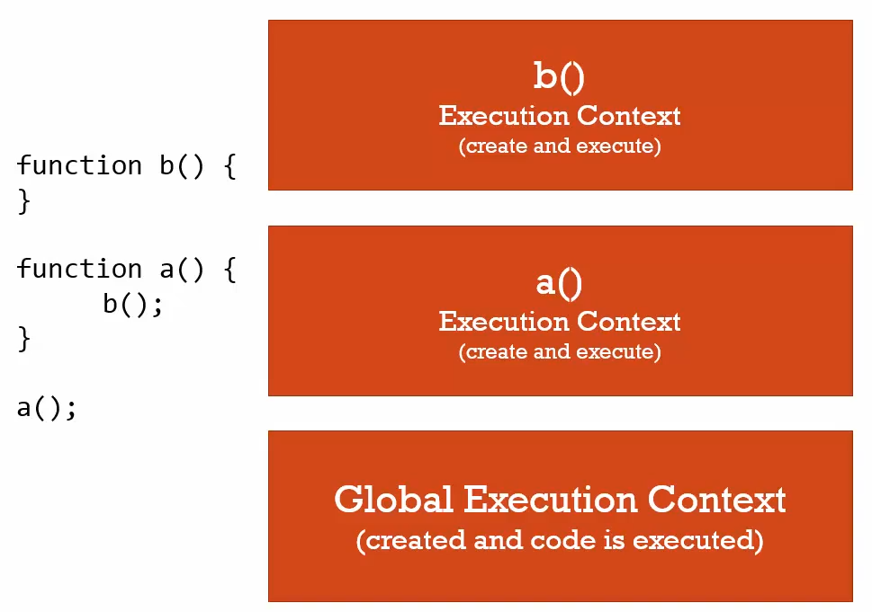

## In this avobe example

### At the `compilation` phase 
         `function b` and function `a` sits in the global execution context. 
### And in the `interpretation` phase
          when a() is invoked a new execution context will be created for `function a` and inside `function a` when 
          `function b` is invoked a new execution context will be created for `function a`

##### what happens when you invoke a function? 

see what happens in the code 
+ global exectution context created (create this, window)
+ creating phase: b and a functions will be in the memory 
+ then code will start executing line by line
+ a() will invoke function a
+ new execution context created and put on the stack on top of Global 
+ b() invoked another execution context for b gets created an put on top of a context.
