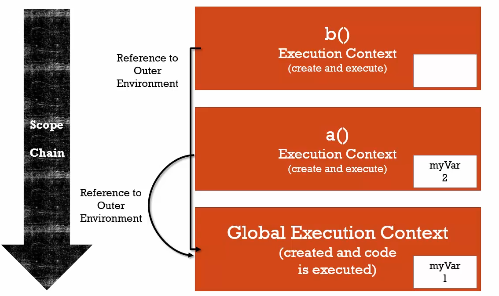
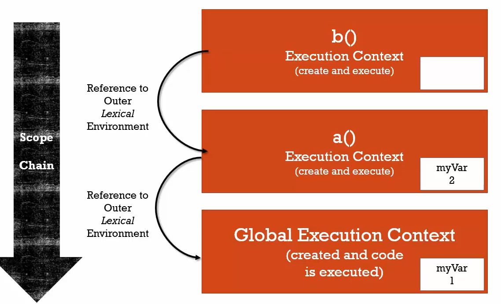

## Scope Chain

things you should know
+ every execution context has a reference to outer environment.

```js
// Simple example of Scope chain

function b() {
	console.log(myVar);
}

function a() {
	var myVar = 2;
	b();
}

var myVar = 1;
a();

// OUTPUT IS 1
```



## In the above example,
### At the compilation phase
`function b`, `function a` and `variable myvar` will sits in the global execution context.
### At the interpretation phase,
 when `function a` is invoked, a new execution context for `function a` will be created. When `function b` is invoked inside
 `function a` a new execution context will be created for `function b`. Inside `function b` `variable myvar` is printed. What will be the output? You may think that the output will be `undefined`. But the thing is in JS where you write something is important I mean `lexical environment` matters. When `function b` doesn't find `myvar` in its execution context, it looks where this function `lexically situated` by the time its creation. You already know it is situated in the global execution context by the time of its creation. 
 
 In global execution context `myvar=1`. So, the output is 1. Here, `global execution context` is the outer reference for
 `function b`. This incident is called `Scope chain`.
 
```js
function a() {
  function b() {
      console.log(myVar); // 2
  }	
	var myVar = 2;
	b();
}
var myVar = 1;
a();
```

