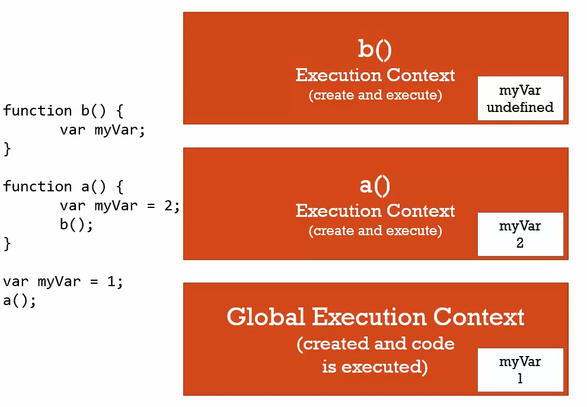

#### variable environment
where the variable lives 


+ every execution context has it's own variable environment.
+ even though myVar is declared three times they are distict (don't touch each other)

heres a sample code
```js
function b(){
  var myVar;
  console.log(myVar); // undefined
}

function a() {
  var myVar = 2;
  console.log(myVar); //2
  b();
}

var myVar = 1;
console.log(myVar); // 1
a();
console.log(myVar); // 1
```