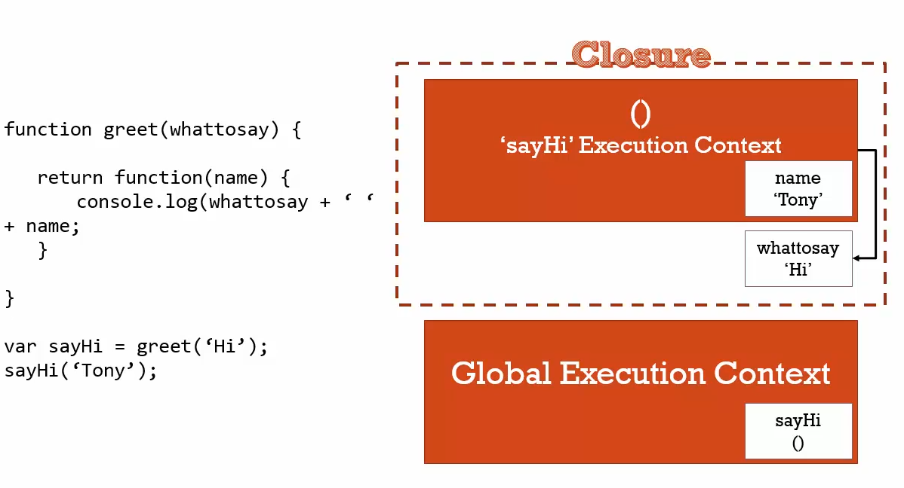

### CLOSURES

```js
function greet(whattosay) {
  return function(name) {
    console.log(whattosay+' '+name);
  }
}
var sayHi = greet('Hi')
sayHi('Tony')
// Hi Tony
```



**wait a sec** \
How does sayHi knows about whattosay variable it should be gone by then.???? isn't it???
+ some how what to say is hanging around !!!

**Closures is a feature of js language.a closure gives you access to an outer function’s scope from an inner function.even if the outer functions execution is done**
+ every execution context has space in memory where variable and functions created inside of it live.
+ when the execution context popped out. it still hangs around for sometimes untill the grabage collector clears it out.
+ so greet execution context is gone but what's in memory isn't. 

#### Example


**using let**
+ let creates a new variable every time the loop runs. everytime a new variable in memory.
+ i will be segmented in the memory of execution context.


**using eife**
+ in order to preserve the value of i.
+ we need seperate execution context which can be created by eife


**closures & callbacks**

+ set timeout taking a function object(function expression), time.
+ sayHiLater is done executing.
+ so this callback function is taking advantage of closures.

```js
function sayHiLater () {
  var greeting = 'Hi';
  setTimeout(function(){
  	console.log(greeting);
  },300)
}
sayHiLater()
```
