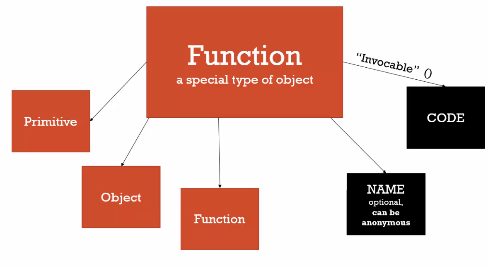

### function 
In Javascript functions are first class functions that means\
+ you can assin them in a variable 
+ pass them as a param 
+ create them on the fly. (create them as while passing to other function)


In js functions are objects. With two speacial property. 
+ name (name of the function)
+ code (body of the function)


 \
other than that you can attach primitive, objects and function just like the regular object.

**Epression** : Unit of code results value. It can be assigned in a variable 
```js
a=3 // 3
2+3 // 5
```

**Statement** : it doesn't return value. it's just piece of code. \
ex: if statement we can not assin in a variable \

**function as a satatement & expression**

```js
function anonymousGreet(){
  console.log('hey');
}

// throw an ref error as it is a variable set to undefined
// can not access before initialization
anonymousGreet() 

var anonymousGreet = function anonymousGreet(){
  console.log('hey');
}
anonymousGreet()
```


