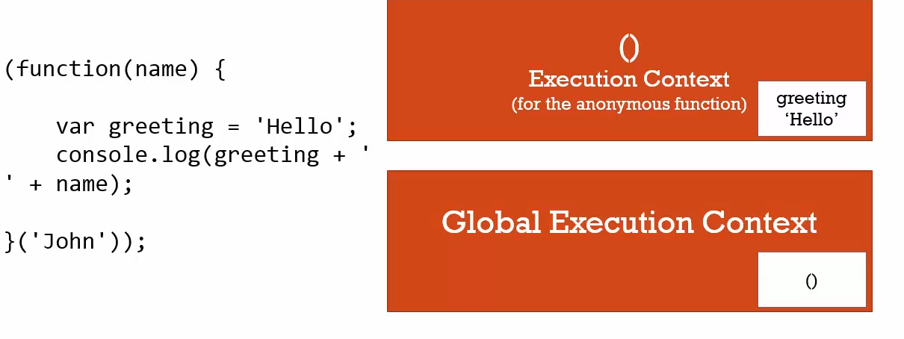
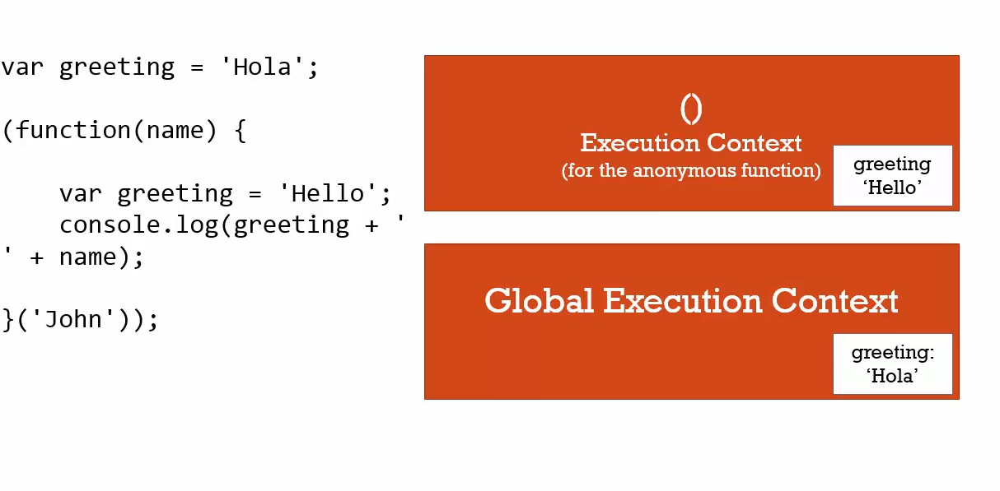

### IFFE

```js
// immediately invoked function expression
var greeting = function(name) {
  return 'Hello'+ name;
}('sumit');
console.log(greeting) // Hello sumit
```

see the following function statement \
**the following will throw an ERROR**
```js
function (name){
  return 'Hello' + name;
}

// but this one won't throw error
// now this is an expression as it's inside the paranthesis
(function (name){
  return 'Hello' + name;
})('sumit')
```

**why iffe is powerful**
+ it doesn't interfere with any other part of the code
+ this pattern makes it difficult to crash with the GLOBAL object.


```js
var greeting = 'Hola';
(function(name) {
  var greeting = 'Hello';
  console.log(greeting + '' + name);
})('sumit');

```