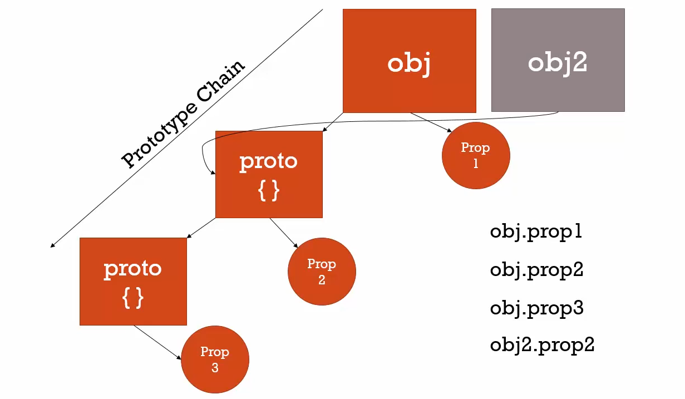

## Prototype

##### classical vs prototypal inheritance 

```Inheritance: One Object gets access to the properties and methods of another object.```

##### facts 
* all objects has a prototype property which is another object (proto { })
* objects can share same prototype


```
var person = {
  firstName: 'Default',
  lastName: 'Default',
  getFullName: function() {
    return this.firstname + ' ' + this.lastname;
  }
}

var john = {
  firstName: 'John',
  lastName: 'Doe'
}

john.__proto__ = person;
console.log(john.getFullName())
// John Doe
console.log(john.firstName);
// John 

var jane = {
  firstName: 'Jane'
}

jane.__proto__ = person;
console.log(jane.lastName)
// Default
console.log(jane.getFullName());
// Jane Default
john.hasOwnProperty('firstName') // True
john.hasOwnProperty('getFullName') // False

```

#### question how do you get access to properties and method on object/array/function
```
var a = {};
var b = function() {};
var c = [];

a.__proto__ // valid
// Object {} // returns base object
b.__proto__ // valid
// function Empty() {}
b.__proto__.call // (apply , bind)
c.__proto__ //valid
// []
c.__proto__.push //(map, reduce)
```

```what's the prototype of a prototype ans: base Object { }```
